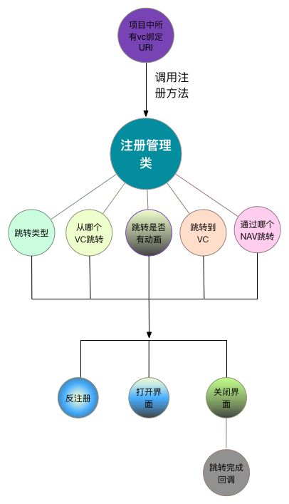

# UIRouter

[](https://travis-ci.org/“caoye”/UIRouter)
[](http://cocoapods.org/pods/UIRouter)
[](http://cocoapods.org/pods/UIRouter)
[](http://cocoapods.org/pods/UIRouter)

## Example

To run the example project, clone the repo, and run `pod install` from the Example directory first.

## Requirements

`UIRouter`是一款通过URI绑定VC跳转界面的工具，从而达到解除项目中的耦合性。

### 跳转类型 `JumpType`

```
Push,    
Present,
Pop,     
PopRoot,
PopSome,
Dismiss,   
```

## 思维导图




### 提供的接口方法

方法名称	 	| 方法描述     						 | 需要参数类型
----------- | ------------------------------ | ------------
JumpType    |跳转类型      	 					| JumpType
fromVC   	 | 从哪个VC跳转  					 |UIViewController *
toVC     	 | 跳转到VC       		  			 | UIViewController *
fromNav 	 | 从哪个NAV跳转（默认为当前页面导航）	 | UINavigationController *
animated	 | 是否有动画，（默认YES） | BOOL
closeWithUrl | 关闭界面   					 | NSString *
getVCFromUrl | 根据URL生成VC   				 | NSString *
deregisterURL| 注销URL  					 | NSString *
handler      |界面跳转完成的回调操作(对应模态界面的回调，push操作不执行)|
 

### 注册URL
```objectivec
	+ (void)registerURL {
	 [[UIRouter shareInstance] registerURLPattern:vcOnerac Class:[MineViewControllerOne class] toHandler:^(id param, UINavigationController *nav, JumpType type, UIViewController *fromVC) {
        MineViewControllerOne * toVC = [[MineViewControllerOne alloc] init];
        [self jumpTovc:type nav:nav fromeV:fromVC toVC:toVC];
    }];
	}
```
### 调用注册方法
```objectivec
 NSArray *moduleArray = @[ @"MXLoginModule", @"MineModule", @"AddressBookModule", @"MXMessageModule", @"PhotoAssetsModule", @"ClientApprovalMoudle" ];
    for (NSString *moduleString in moduleArray) {
        Class class = NSClassFromString(moduleString);
        SEL sel = NSSelectorFromString(@"registerURL");
        IMP imp = [class methodForSelector:sel];
        if (imp) {
            void (*func)(id, SEL) = (void *)imp;
            func(class, sel);
        }
    }
```


### 打开界面调用

```objectivec
self.router.openUrl(@"ichat://work/vcOnerac?name=zhangsan&age=10")
self.router.openUrlWithParam(@"ichat://work/vcOnerac",{@"name":@"zhangsan"});
```		 
 		
### 带回调的调用
```objectivec
 [self.router.jump(Present).openUrl(vcTwoarc) handler:^{
      NSLog(@"present 完成");
      }];
```
        
### 关闭界面

```objectivec
self.router.closeWithUrl(vcOnerac);
```	 

### 反注册URL 
```objectivec
self.router.deregisterURL(vcOnerac);
```

可以用self.router调用，也可以用UIRouter.router去调用，由于用的函数式编程写法，每个方法返回的都是UIRouter的实例，根据跳转类型添加自己需要的方法，但是openUrl方法或者closeWithUrl方法一定要写到最后调用，


## 用法方便之处

*我们可以把方法调用比做一个正在流水的水龙头，我们想控制水的流向和水流的大小，我们通常的方法是在方法的时候做很多处理，然后控制水流的特性，但当我们应用了这种方式，我们可以在方法调用的入口（self.router）和调用的出口（openUrl）之间插入我们想要的水流的特性，来控制水流，self.router.`jump(Present).animated(NO)`.openUrl(@"xxx")*


## Installation

UIRouter is available through [CocoaPods](http://cocoapods.org). To install
it, simply add the following line to your Podfile:


`pod "UIRouter"`


## Author

“caoye”, “1595576349@qq.com”

## License

UIRouter is available under the MIT license. See the LICENSE file for more info.
